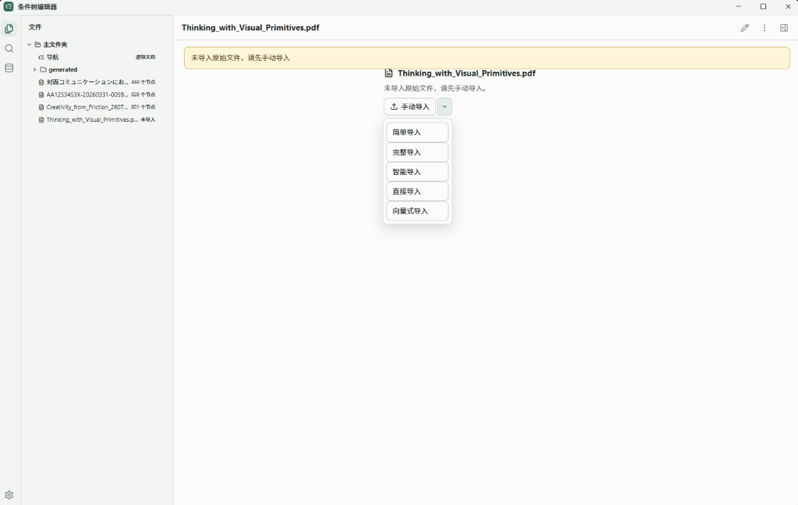
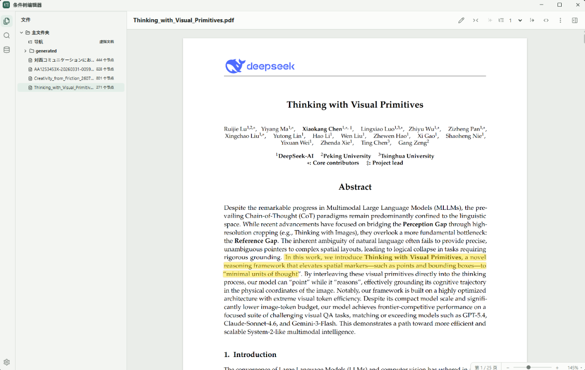
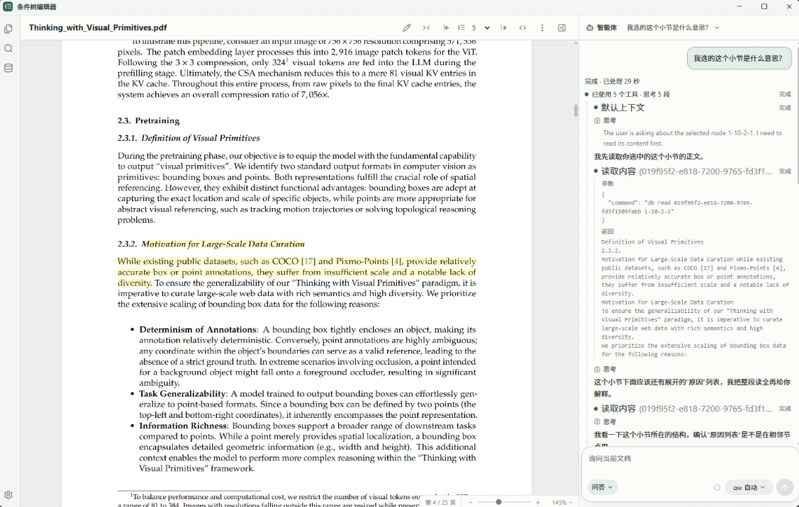
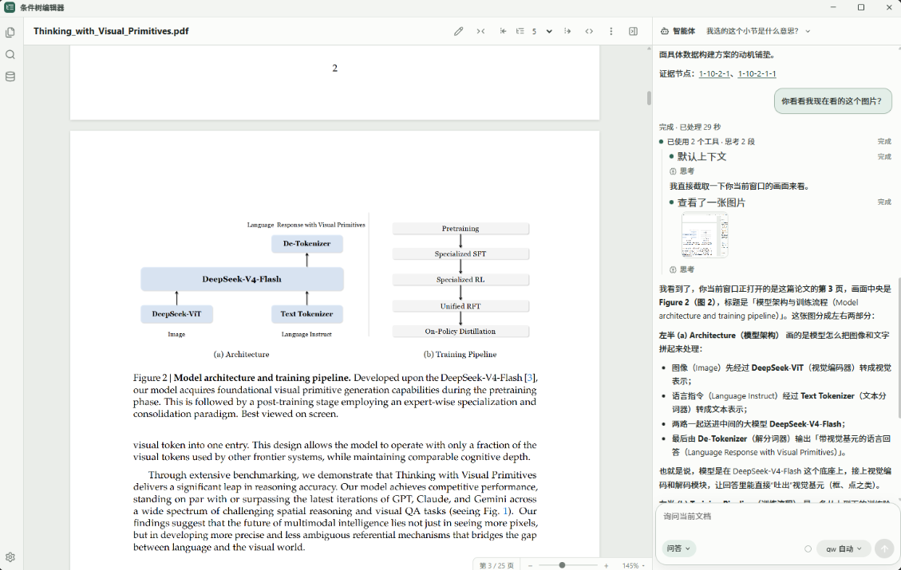
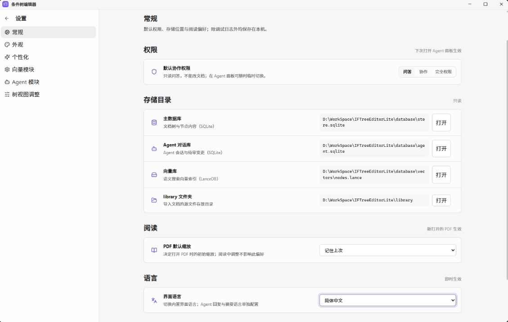
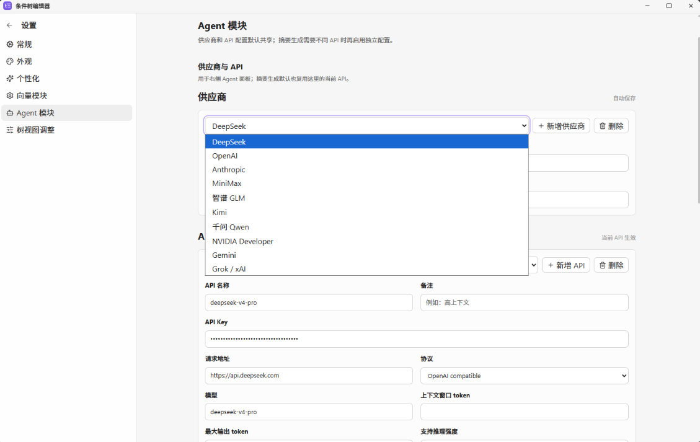

# IF-Tree Editor Lite · 条件树编辑器（精简版）

**简体中文** · [English](README.en.md)

> 本地优先的文档数据管理工具：把多文档语料整理成带稳定地址的 if-tree 条件树，便于在大规模原文（设计目标为百亿字级）中精确定位所需片段。检索结果可回溯到具体出处，也可通过 MCP 交由外部 agent 框架协作处理。
>
> **IFTreeEditorLite 是 [IFTreeEditor](https://github.com/Meari-Prototype/iftree-editor) 的精简版：严格的单机个人向知识库**——如需企业级多端复杂部署，请参考其姐妹项目 [IFTreeEditor](https://github.com/Meari-Prototype/iftree-editor)。本项目基于 IFTreeEditor 的 **0.6.6** 版本开发，对多数场景采用乐观方式处理，并大幅精简功能面。当前前端在只读模式下已无明显 bug 或崩溃；**试用时可最先尝试 PDF 视图下的论文阅读体验**。


> **项目状态：0.2.1，早期开发阶段。** 项目仍在活跃开发中，请按早期版本对待：
>
> - **前端**：只读模式（含 PDF 论文阅读）已无明显 bug 或崩溃；编辑与协作功能仍在完善。
> - **后端写入路径**：缺少长期使用的实测——项目开发时间尚短，客观上还没有积累足够的长时运行数据。
> - **已就绪可用**：核心的 **MCP 只读查询服务**与 **db 命令契约**已经稳定可用，只读检索是当前最可依赖的部分。
>
> 版本变更见 [CHANGELOG](CHANGELOG.md)。

---

## 目录

- [快速开始](#快速开始)
- [简介](#简介)
- [文档](#文档)
- [功能特性](#功能特性)
- [界面预览](#界面预览)
- [技术栈](#技术栈)
- [环境要求](#环境要求)
- [配置](#配置)
- [数据存储](#数据存储)
- [语义向量](#语义向量)
- [导入与导出](#导入与导出)
- [MCP 与外部 agent](#mcp-与外部-agent)
- [项目结构](#项目结构)
- [开发与测试](#开发与测试)
- [许可证](#许可证)
- [致谢](#致谢)

---

## 快速开始

首次安装依赖：

```powershell
npm install
```

构建前端并启动应用：

```powershell
npm run build
npm run app
```

> `npm run app` 会先构建、再把 better-sqlite3 按 node ABI 预编译。桌面端是 Electron 外壳，但前端不再 in-process 用原生模块，由主进程拉起独立的 node 后端进程。修改主进程或 preload 后，需要重启 Electron 窗口。

开发模式需要两个终端。终端 1 启动 Vite dev server：

```powershell
npm run dev
```

终端 2 让 Electron 加载该地址：

```powershell
$env:IFTREE_WEB_URL = 'http://127.0.0.1:5173'
npm run app
```

Windows 上也可以直接双击 `start.bat`。Linux / macOS 在项目根目录运行：

```sh
sh start.sh
```

两个脚本都会自动完成“安装依赖 → 构建 → 启动”。

## 简介

IF-Tree Editor 是一个本地优先的文档数据管理工具，面向规模较大的多文档语料（设计目标为百亿字级）。它要解决的问题是：在大量原文中准确找到需要的片段，并保证结果可核对、不被模型臆测替代。为此，它把原文整理成带稳定地址的条件树：

- 每个节点有形如 `1`、`1-3`、`1-3-2` 的地址：`1` 为根节点，`1-3` 是 `1` 的第 3 个子节点，地址前缀表示父子关系。地址由 `parent_id + sort_order` 动态生成，使每个句子都有可引用的固定坐标。
- 关键词检索与本地语义检索配合句子级 offset 映射，可将命中定位到具体句子，而非整篇文档。默认由 Ollama 运行 `qwen3-embedding:0.6b`，初始输出 384 维向量。
- 数据存于本地（SQLite + LanceDB），不依赖云服务。内置 Agent 回答事实问题时需先读取正文证据并给出证据节点地址，不以模型常识作答，便于核对。
- 通过 MCP 将文档库以分级权限（问答 / 协作 / 完全）开放给外部 agent 框架，用于检索与协同处理。

同一份内容可在两种阅读密度之间切换：折叠时呈现为 Markdown 文档，展开时呈现为条件树；导入时保留句子到原文的 offset 映射，使两种视图对应同一份原文。

## 文档

- [上手教程](docs/getting-started.md)——从安装到第一次检索，15 分钟走通核心流程。
- [操作指南](docs/how-to.md)——配置 LLM、构建向量、各格式导入、智能导入、接入外部 agent、备份。
- [参考手册](docs/reference.md)——MCP 工具、db 命令、import-json 契约、配置与环境变量的查表清单。
- [概念与设计](docs/concepts.md)——地址、信任分级、唯一草稿、共享后端的设计与取舍。
- [更新日志](CHANGELOG.md)

## 界面预览

PDF 论文阅读是本项目的首选体验：从导入到阅读、再到让 Agent 看图讲解，一次走通。

| 文档导入 | PDF 论文阅读 |
|----------|--------------|
|  |  |
| 未导入的文档可选手动导入，支持简单 / 完整 / 智能 / 直接 / 向量式五种模式。 | 导入后在 PDF 视图中阅读论文，支持高亮标注与句子级定位。 |

| Agent 问答当前小节 | Agent 截图理解图片 |
|--------------------|--------------------|
|  |  |
| 选中小节后向 Agent 提问，Agent 读取正文证据并给出证据节点地址。 | Agent 用 `db screenshot` 截取当前窗口，直接看懂并讲解论文中的插图。 |

| 设置 · 常规 | 设置 · Agent 模块 |
|-------------|-------------------|
|  |  |
| 权限、存储目录、阅读偏好与界面语言集中管理，除调试日志外均保存在本机。 | 供应商与 API 配置，支持 OpenAI / Anthropic 兼容接口，多供应商一键切换。 |

## 功能特性

- **精确检索**：关键词检索 + 本地语义检索，配合句子级 offset 映射，把命中定位到具体几句；默认使用 Ollama 上的 Qwen3 Embedding 0.6B、384 维，查询自动加检索 instruction，中文、英文、日文均可检索。
- **基于证据的回答**：内置 Agent 回答事实问题时需读取正文证据并给出证据节点地址，不以模型常识或题目措辞作答，结果可核对。
- **本地优先存储**：文档、节点、ERROR、引用关系与历史存于 SQLite，节点级语义向量存于 LanceDB，无需任何云服务即可使用。
- **Agent 协作与 MCP**：内置 Agent 与 MCP 服务共用一套权限分级（问答 / 协作 / 完全 / 人类）；外部 agent 框架可检索读证据，协作档只能在唯一草稿中修改节点备注 / 类型、引用与实体。LLM 支持 OpenAI 兼容与 Anthropic 兼容接口。
- **稳定地址的条件树**：节点地址形如 `1-3-2`，由 `parent_id + sort_order` 动态生成，使每个句子可被精确引用。
- **双密度阅读**：折叠呈现为 Markdown 文档，展开呈现为可操作条件树；树视图默认展开到真实最大深度，可逐层展开 / 收起 / 全部展开 / 全部折叠。
- **轻量工作台**：主窗口采用文档栏、正文区、LLM 区三列结构；正文区只保留树视图与富文本，关键词/向量搜索收进左栏，实体维护使用独立窗口。
- **受限节点编辑**：编辑模式只允许修改节点类型与备注；正文和树结构不可编辑；草稿内支持撤销 / 重做。
- **单草稿快进提交**：每篇文档最多一份活跃草稿，定稿只做 `commit` 快进，不提供 merge、rebase、cherry-pick 或冲突裁决。
- **共享后端**：一库一后端进程，应用、MCP、命令行通过命名管道共用，同时在线互不冲突。
- **多格式导入与整库备份**：导入 CHM、TXT、Markdown、PDF、DOCX、EPUB；结构不规则的源文可在应用内走智能导入（LLM 产 JSON，经逐字节校验后入库）；Excel / CSV 普通导入及数据库中继尚未实现；运维脚本支持整库 JSON 导出 / 导入（Markdown 文档导出重新设计中、临时停用）。
- **AI 摘要备注**：调用 OpenAI / Anthropic 兼容接口，为单个节点、子树、当前层级或全文生成摘要备注。
- **节点元数据**：节点类型、备注、ERROR、引用关系与保存历史。

## 技术栈

| 领域 | 选型 |
| --- | --- |
| 桌面框架 | Electron 39 |
| 界面 | React 19 + Vite 7 |
| 本地数据库 | better-sqlite3 |
| 向量数据库 | LanceDB |
| 语义向量 | Ollama（默认 `qwen3-embedding:0.6b`）；保留 Transformers.js BGE 选项 |
| Agent / 工具协议 | @modelcontextprotocol/sdk（MCP） |
| 其它 | pdfjs-dist、fflate、lucide-react、@radix-ui |

## 环境要求

- **操作系统**：Windows 10 / 11；Linux / macOS 可使用 POSIX shell 启动脚本（当前开发与验证主要在 Windows 上进行）。
- **Node.js**：建议 20 LTS 或更高（验证在 Node 24 上进行）。原生模块（better-sqlite3）按 node ABI 预编译（`prebuild-install` 下载，无需编译工具链）；测试、CLI、MCP、后端服务均纯 node 运行（ABI 说明见[开发与测试](#开发与测试)）。
- **包管理器**：npm。
- **语义向量模型（可选）**：项目启动不要求安装 Qwen3 或 BGE 模型；未安装时只不能构建和使用语义向量，关键词检索及其他功能不受影响。使用默认 Qwen 时需要本机 Ollama 与 `qwen3-embedding:0.6b` 权重；选择 BGE 时才需要可选的 Transformers.js 本地推理依赖。
- **GPU（可选）**：Ollama 自行决定使用 CPU / GPU；选择 Transformers.js BGE 模型时可在设置页切换 WebGPU / CPU。

## 配置

### LLM 接口（`.env`）

复制 `.env.example` 为 `.env` 并填入你的 Key。LLM 摘要与内置 Agent 支持两种接口协议，可在设置页按供应商选择：

- **OpenAI 兼容**：请求 `{baseUrl}/chat/completions`。
- **Anthropic 兼容**：请求 `{baseUrl}/v1/messages`，使用 `x-api-key` 与 `anthropic-version` 请求头，需要在 API 配置中填写最大输出 token。

Ollama 本地模型与 DeepSeek 等服务都可通过上述协议接入（DeepSeek 的 Anthropic 兼容端点默认为 `https://api.deepseek.com/anthropic`）。

设置页内置 OpenAI、Claude、MiniMax、智谱 GLM、Kimi、千问 Qwen、Gemini、Grok / xAI 与 NVIDIA Developer 供应商预设。千问预设使用 Token Plan 的 Anthropic Messages 兼容端点，包含 Qwen3.8 Max Preview、Qwen3.7 Plus 与 Qwen3.6 Flash；API Key 仍由你在设置页填写。

下面是 OpenAI 兼容方式的常用环境变量：

```dotenv
OPENAI_API_KEY=your-api-key
OPENAI_BASE_URL=https://api.deepseek.com
OPENAI_MODEL=deepseek-v4-pro
```

设置页中维护的多供应商配置会写回 `.env`，详见文件内注释。`.env` 已在 `.gitignore` 中，不会被提交。

### 应用配置（`iftree.config.json`）

控制摘要策略、Agent 工具参数与 debug 日志，例如摘要的字数上下限、压缩比例和搜索结果条数。debug 日志写入 `.iftree-debug/`，字段说明见[参考手册](docs/reference.md#配置与环境变量)。

### 数据目录（`IFTREE_HOME`）

设置环境变量 `IFTREE_HOME` 可覆盖默认数据目录，便于测试或隔离不同数据集。

## 数据存储

应用涉及四类本地数据：你管理的**文档库**、由它解析出的**主数据库**、独立的 **Agent 会话库**，以及可重建的**派生数据**（向量与附件）。

### 文档库（`library/`）

`library/` 位于项目根目录，是存放并组织全部源文档（`.chm` / `.txt` / `.md` / `.pdf` / `.docx` / `.epub`）的工作区，可按文件夹分层。它是这个工具最核心的数据：应用内以文件夹树浏览、组织文档库，内置 Agent 也只能在 `library/` 内按权限以相对路径读写，不暴露绝对路径。

`library/` 已在 `.gitignore` 中——它是你的数据，不随仓库分发。它与 `docs/` 完全是两回事：前者是被管理的文档语料，后者只是项目文档，不要把 `library/` 并入 `docs/`。

### 主数据库与 Agent 会话库

导入后解析出的结构化数据——文档、节点、ERROR、引用、实体与提交历史——存于项目根的 `database/store.sqlite`（已在 `.gitignore`），可用环境变量 `IFTREE_DB` 指定其他路径。

内置 Agent 的会话、消息与上下文单独存于同目录的 `database/agent.sqlite`；待审修改复用主数据库中的文档唯一草稿。备份对话记录时需要同时保存这个文件。

### 派生数据（默认 `database\`，可用 `IFTREE_HOME` 覆盖）

向量与附件默认写入主库同目录 `database\`（默认锚定工作区，避免与 SQLite 分家；仍可用 `IFTREE_HOME` 覆盖）：

```text
database\               # 与主库 store.sqlite 同目录（IFTREE_HOME 默认）
  vectors\nodes.lance\  # 节点级语义向量
  assets\doc-<id>\      # 文档附件（图片等）
```

原始 Markdown 阅读源保存在 SQLite 的 `source_documents` / `source_spans`，句子切分只保存 offset 映射，不重组正文结构；树节点可聚合显示 `23-25;27-28;32` 这类句子编号范围。

## 语义向量

- 默认模型为 Ollama 的 `qwen3-embedding:0.6b`，默认 384 维；设置页允许在模型支持的 32–1024 维范围内调整。数据库按当前维度精确校验。
- 文档正文按原文生成 passage 向量；语义检索词由后端自动添加 Qwen 官方英文检索 instruction，再生成 query 向量。instruction 不会写回节点正文。
- Qwen 模型文件和 CPU / GPU 调度由 Ollama 管理，因此设置页会禁用 Transformers.js 的计算目标、本地模型路径与下载按钮。首次使用前运行 `ollama pull qwen3-embedding:0.6b`。
- 保留 BGE-M3、BGE Large ZH v1.5、BGE Large EN v1.5 三个固定 1024 维选项。Transformers.js BGE 路径可选择 WebGPU / CPU、本地 ONNX 目录与手动下载；默认 4 个 worker、每批 16 条文本。
- 模型或维度变化会清空旧的 LanceDB 表并按新 schema 重建，防止不同模型或不同维度的向量混用；设置页也可关闭导入时自动生成向量。

## 导入与导出

**导入**

| 格式 | 说明 |
| --- | --- |
| CHM `.chm` | 以 `.hhc` 目录和 HTML 正文生成结构树 |
| 文本 `.txt` | 按标题行、段落和句子生成层级结构 |
| Markdown `.md` | 按 heading、段落和句子生成层级结构 |
| PDF `.pdf` | 带文本层映射的 PDF 导入 |
| DOCX `.docx` | 按 OOXML 段落样式 `<w:pStyle>` 识别标题层级 |
| EPUB `.epub` | 解析章节结构与正文，句子可定位回原文 |

Excel `.xlsx` 与 CSV `.csv` 当前不支持普通文档导入；数据库中继格式也尚未实现。

结构不规则、规则解析不出来的源文可在应用内走**智能导入**：LLM 观察源文写一次性切割脚本产出 JSON，经 `db import-json` 逐字节校验入库，正文只能是源文切片、不允许改写。通用 `db import` / MCP `import` 的 `smart` 模式当前未接入；外部 agent 应直接遵循 `smart-import` 契约并调用 `db import-json`（详见[操作指南](docs/how-to.md#用智能导入处理无规则结构的源文)）。

**导出**：运维脚本可把整库导出为带 schema 版本头的 JSON，并可导入到全新空库。Markdown 文档导出正在重新设计，本版临时停用。

## MCP 与外部 agent

MCP server 把文档库开放给 Claude Code、Codex 等外部 agent 框架，stdio 传输，权限档在启动时由环境变量 `IFTREE_MCP_TIER` 锁定：`read`（检索与读取，默认）、`edit`（+ 唯一草稿、导入与删除）、`full`（+ 恢复 / 反向提交、向量重建、源文件重绑、联网检索与对象库 GC）、`human`（别名 `yolo`，在 full 基础上可执行节点背书，是标受控的唯一入口）。

客户端配置示例（以项目根为工作目录）：

```json
{
  "mcpServers": {
    "iftree-library": {
      "command": "npm",
      "args": ["run", "--silent", "mcp:node"],
      "env": { "IFTREE_MCP_TIER": "read" }
    }
  }
}
```

应用、MCP、命令行共享同一个后端进程（一库一后端），可同时在线。工具清单与 `db` 命令契约见[参考手册](docs/reference.md)；外部 agent 的智能导入契约随仓库分发在 [`.iftree-llm-workspace/skills/`](.iftree-llm-workspace/skills/)。

## 项目结构

```text
.
├── electron/
│   ├── web-shell.ts      # Electron 薄壳：启动本地 Web 服务、加载 WebUI、管理主窗口与实体窗口
│   ├── ipc-channels.ts   # IPC 通道常量
│   └── preload.ts        # 只暴露窗口、文件选择和实体窗口等 OS 能力
├── index.html            # 渲染进程入口 HTML
├── src/
│   ├── renderer/
│   │   └── main.tsx      # React 挂载入口
│   ├── frontend/         # 界面层
│   │   ├── App.tsx       # 装配根：hook / 命令装配与 context 组装
│   │   ├── screens/      # 整屏拆分：编辑器 / 设置 / 左侧栏 / 工作区 / 弹窗宿主
│   │   ├── commands/     # 命令层：editor / document / agent / treeView 业务动词
│   │   ├── stores/       # 轻量 store 与编辑生命周期状态机
│   │   ├── session/      # 文档会话：窗口化加载与驱逐、撤销栈与快照令牌
│   │   ├── components/   # 树视图、富文本、搜索、Agent、实体窗口与设置组件
│   │   ├── hooks/        # 文档状态、布局、选择、设置等 React hooks
│   │   ├── data/         # HTTP RPC / 仓储 / 服务封装
│   │   ├── features/     # 实体、库、设置等功能动作
│   │   ├── lib/          # 前端工具函数
│   │   └── styles.css
│   ├── backend/web/      # 本地 HTTP RPC、SSE、静态 WebUI 与设置读写
│   ├── backend/          # 后端业务逻辑（跑在独立 node 后端进程）
│   │   ├── store/        # 存储底座 / 历史 / 编辑分支子系统（SQLite schema 与文档/节点写操作）
│   │   ├── db/           # schema、id、归一化、快照历史、内容寻址对象库
│   │   ├── entities/     # 实体读写与投影
│   │   ├── editor-session/ # 编辑器会话与快照令牌
│   │   ├── diff/         # ref / view 差异计算
│   │   ├── derived-index/ # 衍生索引（keyword / semantic-status）与自对账
│   │   ├── projection/   # 编辑分支投影缓存
│   │   ├── source/       # 源文档地址映射
│   │   ├── text/         # 文本预算 / 合并
│   │   ├── import/       # 导入编排与 JSON 落库
│   │   ├── library/      # 库文件系统与虚拟文档
│   │   ├── handlers/     # 读 / 写命令处理器
│   │   └── llm/          # Agent 运行时、共享后端 SDK（命名管道）、headless agent、LLM 设置
│   ├── mcp/              # MCP server 入口（`src/mcp/mcp-server.ts`，产物 `dist/src/mcp/mcp-server.js`）
│   ├── core/             # 纯逻辑（无 Electron 依赖）
│   │   ├── tree.ts       # 树构建、动态地址、扁平化 / 遍历
│   │   ├── mindmap.ts    # 树视图投影、深度控制、布局
│   │   ├── merkle.ts / merkle-diff.ts # 树哈希与历史差异
│   │   ├── source-text.ts / source-pdf.ts / source-docx.ts / source-chm.ts / source-epub.ts # 配合 import-formats/ 解析 txt/md/pdf/docx/chm/epub
│   │   ├── source-markdown.ts # 原文解析与句子 offset 映射
│   │   └── ...           # viewport、markdown、tree-cursor、tree-ui、flat-tree 等
│   ├── vector/           # 语义向量：embeddings、vector-store、worker、模型下载
│   └── agent/            # Agent 配置与会话存储
├── scripts/              # CLI 工具：db 命令、native 重编、验证脚本、导入/导出/迁移
├── tests/                # node:test 单元测试
├── docs/                 # 项目文档：教程 / 操作指南 / 参考 / 概念
├── .iftree-llm-workspace/
│   └── skills/           # 面向 LLM 的导入契约（随仓库分发）
├── library/              # 文档库工作区：你管理的源文档（运行时生成，已在 .gitignore）
├── database/             # store.sqlite、agent.sqlite 与派生数据（运行时生成，已在 .gitignore）
├── iftree.config.json    # 摘要策略 / Agent 工具 / 渲染模式配置
└── .env.example          # 环境变量模板（LLM 接口）
```

## 开发与测试

```powershell
npm run lint          # ESLint 静态检查（src / electron / scripts / tests）
npm run check:types   # TypeScript 类型检查（core 已类型化，其余模块逐步迁移）
npm run build         # 生产构建（esbuild 把运行时 .ts 编译到 dist/）
npm run check:native  # 校验 native module 与 node ABI 匹配
npm test              # node --test 运行单元测试
npm run test:verbs    # node --test 运行 db 动词契约套件
```

> 样例验证脚本 `verify:samples` 依赖本地样例数据，需自行准备对应文件后再运行。

> **原生模块 ABI**：原生模块（better-sqlite3、LanceDB）是按运行时 ABI 编译的二进制。本项目统一使用 **node ABI**——better-sqlite3 走 `prebuild-install` 下载 node 预编译包（无需编译工具链），`@lancedb/lancedb` 是 N-API 预编译、node 与 Electron 通用。测试、CLI、MCP、后端服务都用系统 `node` 运行（`npm test` / `node dist/scripts/<脚本>.js` / `npm run mcp:node`）。桌面 `npm run app` 仍是 Electron 外壳，但前端不再 in-process 用原生模块、由主进程拉起独立 node 后端，Electron 自身零原生重编；`npm run check:native` 校验 better-sqlite3 与 node ABI 匹配。

## 许可证

本项目基于 [Apache License 2.0](LICENSE) 发布，版权归 Meari 所有（见 [NOTICE](NOTICE)）。

## 致谢

- 界面内置 [Noto Sans CJK](src/frontend/assets/fonts/NOTICE.md) 字体（SIL Open Font License）。
- 默认语义向量使用 [Qwen3 Embedding 0.6B](https://huggingface.co/Qwen/Qwen3-Embedding-0.6B)，并保留 [BAAI/bge-m3](https://huggingface.co/BAAI/bge-m3) 等 BGE 模型。
- 以及 Electron、React、Vite、Ollama、LanceDB、Transformers.js 等开源项目。
- 开发过程中借助 ChatGPT 5.6 sol、ChatGPT 5.5、Claude Opus 4.8、Claude Opus 4.7、Claude Sonnet 5、Claude Fable 5、GLM 5.2、DeepSeek V4 与 Kimi K3 辅助。
